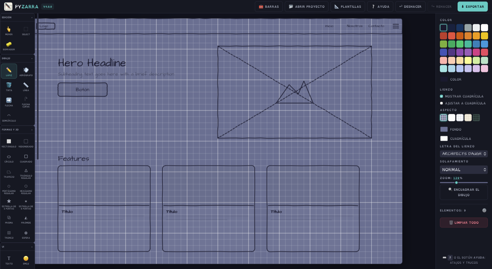

<div align="center">


# Pyzarra

**Pizarra de bocetos y wireframes, como app de escritorio.**

Una ventana nativa carga una web de dibujo hecha en HTML + CSS + JavaScript vanilla —sin frameworks— y le añade lo que un navegador no da:
diálogos nativos de Guardar/Abrir, barra de menús del sistema y persistencia en disco.

[](#)
[](.python-version)
[](pyproject.toml)
[](tests/)
[](#requisitos-por-sistema-operativo)
[](LICENSE)



</div>

---

## Índice

- [Qué hace](#qué-hace)
- [Instalar y ejecutar](#instalar-y-ejecutar)
- [Tests y lint](#tests-y-lint)
- [Empaquetar (macOS)](#empaquetar-macos)
- [Cómo está montada](#cómo-está-montada)
- [Conectar JavaScript con Python](#conectar-javascript-con-python)
- [Requisitos por sistema operativo](#requisitos-por-sistema-operativo)
- [Versiones controladas](#versiones-controladas)
- [Licencia](#licencia)

---

## Qué hace

| | |
|---|---|
| ✏️ **Dibujo con estética de croquis** | Lápiz sensible a la presión, aerógrafo, tinta, líneas, flechas rectas y curvas, formas 2D y 3D, texto y emojis |
| 🧩 **Piezas de wireframe** | Botón, input, navbar, tarjeta, imagen y marcos de pantalla, más catálogos de edificios y jardín |
| 🎛️ **Edición completa** | Selección, alineado, distribución, grupos, orden Z, bloqueo y deshacer/rehacer con 50 pasos |
| 📤 **Exportación** | PNG, JPG, SVG, HTML y JSON —el JSON se reabre como proyecto— y copia al portapapeles |
| 🗂️ **Plantillas y biblioteca** | Estructuras predefinidas (landing, dashboard, formulario) y biblioteca de piezas propias |
| 🧰 **Barras flotantes** | Barra lateral clásica o barras de herramientas arrastrables por el lienzo (botón **Barras**) |
| ⌨️ **Ayuda con buscador** | Todos los atajos y trucos: botón **Ayuda** o la tecla <kbd>?</kbd> |

Todo se guarda en local, en `~/Library/Application Support/Pyzarra/`, con autoguardado continuo.
La app **no pide nada por red**: fuentes autoalojadas y funcionamiento sin conexión.

---

## Instalar y ejecutar

Requiere [uv](https://docs.astral.sh/uv/) **0.12.0 o superior**:

```bash
curl -LsSf https://astral.sh/uv/install.sh | sh   # macOS / Linux
```

Desde la carpeta del proyecto:

```bash
uv sync          # crea .venv e instala todo (no hace falta activarlo)
uv run pyzarra   # abre la app
```

## Tests y lint

```bash
uv run pytest                                          # los 67 tests
uv run pytest tests/test_api.py -v                     # un archivo
uv run pytest -k "corrupto"                            # un test por nombre
uv run pytest --cov=pyzarra --cov-report=term-missing   # con cobertura
uv run ruff check src tests                            # lint
```

Los tests protegen justo lo que rompe la app **en silencio**: que existan y estén enlazados todos los archivos de la web,
que las rutas sean **relativas** (una absoluta abre el `.app` en blanco), el orden de carga de los scripts,
que el puente espere a `pywebviewready`, que cada entrada del menú nativo apunte a un botón real del HTML,
la persistencia (escritura atómica, tolerancia a archivos corruptos) y que todas las versiones estén fijadas.

## Empaquetar (macOS)

```bash
./build-mac.sh    # -> dist/Pyzarra.app (compila con PyInstaller y firma ad-hoc)
```

Icono, firma y detalles: **[EMPAQUETAR-MAC.md](EMPAQUETAR-MAC.md)**.

> [!WARNING]
> `dist/Pyzarra.app` **no se actualiza solo**: tras cambiar código hay que volver a ejecutar el script,
> o seguirás probando la versión anterior sin enterarte. En desarrollo, `uv run pyzarra` usa siempre el código al día.

---

## Cómo está montada

```
src/pyzarra/
├── main.py     <- abre la ventana; en macOS reinstala el menú (workaround Cocoa)
├── api.py      <- puente JS -> Python: diálogos nativos y persistencia en disco
├── menu.py     <- barra de menús del sistema; cada entrada pulsa un botón de la web
└── web/        <- la web de dibujo (build minificado) + bridge.js
    ├── index.html
    ├── css/styles.css
    ├── js/bridge.js    <- ÚNICO JS añadido: conecta la web con pywebview
    └── js/*.js         <- los 19 scripts de la app de dibujo, sin tocar
```

Tres decisiones sostienen la migración de web a escritorio:

1. **Cero ediciones al JavaScript original.**
   `bridge.js` se carga primero e intercepta lo justo: `<a download>` → diálogo nativo de Guardar,
   `<input type=file>` → diálogo de Abrir, y `localStorage` (claves `sketchwire.*`) → espejo en disco vía `api.py`.
   En un navegador normal no hace absolutamente nada.
2. **La lógica de la interfaz vive en JavaScript.**
   El menú nativo (`menu.py`) solo dispara los botones de la web por su `id`, así nunca se desincroniza de lo que hace la app.
3. **`web/` es un build.**
   El código fuente de la web (JS sin minificar, SCSS y sus propias suites de tests) vive en un proyecto aparte;
   aquí llega compilado. Los arreglos se hacen allí y se vuelve a copiar el build (flujo documentado en [`CLAUDE.md`](CLAUDE.md)).

### Conectar JavaScript con Python

```python
# api.py — un método público nuevo queda expuesto a JS automáticamente
class Api:
    def saludar(self, nombre: str) -> str:
        return f"Hola, {nombre}"
```

```javascript
// en la web — esperar SIEMPRE a pywebviewready antes de usar la API
const texto = await window.pywebview.api.saludar("Javi");
```

Los métodos que empiezan por `_` no se exponen; argumentos y retornos deben ser JSON-serializables.

---

## Requisitos por sistema operativo

| Sistema | Motor web | Hay que instalar |
|---|---|---|
| **macOS** | WebKit (WKWebView) | Nada, ya viene |
| **Windows** | WebView2 (Edge) | Normalmente ya viene en Windows 10/11 |
| **Linux** | GTK + WebKit2 | `sudo apt install python3-gi gir1.2-webkit2-4.1` |

## Versiones controladas

| Qué | Dónde |
|---|---|
| Librerías (`pywebview==5.3.2`, …) | `pyproject.toml`, siempre con `==` |
| Versiones exactas de todo el árbol | `uv.lock` |
| Python (3.11) | `.python-version` |
| Herramienta uv (>= 0.12.0) | `pyproject.toml` → `[tool.uv]` |

Los cuatro archivos van a git, `uv.lock` incluido.

## Licencia

[MIT](LICENSE) — © 2026 Javier Tamarit. Traducción orientativa al castellano: [LICENSE.es.txt](LICENSE.es.txt).
